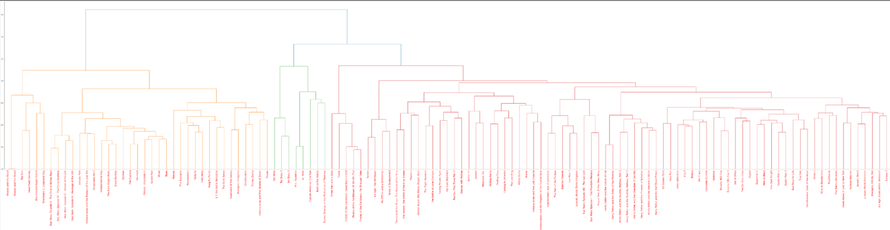

# Movie Plots Analysis

## Table of Contents

1. [Introduction](#introduction)
2. [Data Cleaning](#data-cleaning)
3. [Classification](#classification)
4. [Similar Movie Finder](#similar-movie-finder)
5. [Clustering](#clustering)
6. [Keyword Extraction](#keyword-extraction)
7. [Analyzing the Scripts Classified Plot-wise](#analyzing-the-scripts-classified-plot-wise)
8. [Analyzing the Scripts Decade-wise](#analyzing-the-scripts-decade-wise)
9. [Exploratory Data Analysis](#exploratory-data-analysis)

## Introduction 

The goal of this project is to identify the major plots in movies over time. The analysis focuses on the top 3 IMDb hits from the 1970s to the 2020s. The primary steps include data cleaning, classification, clustering, and exploratory data analysis.

## Data Cleaning 

The data is sourced from a JSON file containing movie scripts. The following cleaning steps were performed:
- Lowercasing all text
- Removing symbols and line breaks
- Eliminating punctuation
- Removing stop words
- Lemmatizing the data for better contextual analysis

## Classification 

A TF-IDF matrix of the movie scripts is created, and similarity distances are computed using cosine similarity. Hierarchical clustering is applied to identify basic plots, and the results are visualized using dendrograms.

## Similar Movie Finder 

Cosine similarity is used to find similar movies based on the TF-IDF vectors of their scripts. A function, `find_similar`, is provided to identify the most similar movie for a given title.

## Clustering 

Scripts are clustered based on their similarity using the KMeans algorithm. The optimal number of clusters is determined using the Elbow Method.

## Keyword Extraction 

Keywords are extracted from the movie scripts using TF-IDF vectors. The top 10 keywords for each movie are displayed.

## Analyzing the Scripts Classified Plot-wise 

The scripts are separated into clusters, and word clouds are generated for each cluster to visualize common themes.

## Analyzing the Scripts Decade-wise 

Scripts are categorized by decade, and word clouds are created to visualize genre trends for each decade.

## Exploratory Data Analysis 

Exploratory data analysis includes converting running time to minutes and visualizing the running time of movies over the years using a bar chart.

---

*Note: This readme provides an overview and explanations of the code. For specific code details, refer to the source code file.*
